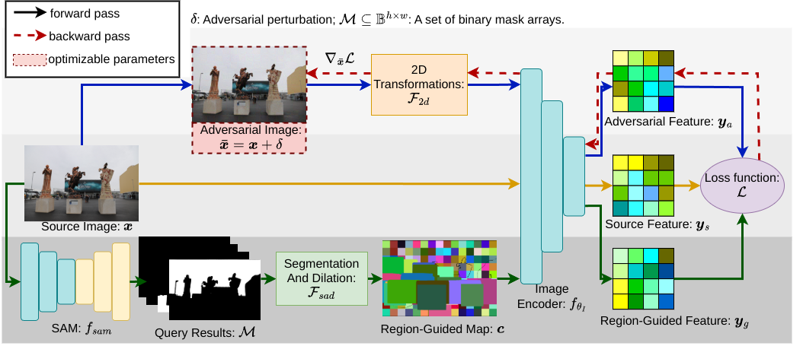

# Region-Guided Attack on the Segment Anything Model (SAM)


[](LICENSE)  
## Abstract
The Segment Anything Model (SAM) is a cornerstone of image segmentation, demonstrating exceptional performance across various applications, particularly in autonomous driving and medical imaging, where precise segmentation is crucial. However, SAM is vulnerable to adversarial attacks that can significantly impair its functionality through minor input perturbations. Traditional techniques, such as FGSM and PGD, are often ineffective in segmentation tasks due to their reliance on global perturbations that overlook spatial nuances. Recent methods like Attack-SAM-K and UAD have begun to address these challenges, but they frequently depend on external cues and do not fully leverage the structural interdependencies within segmentation processes. This limitation underscores the need for a novel adversarial strategy that exploits the unique characteristics of segmentation tasks. In response, we introduce the Region-Guided Attack (RGA), designed specifically for SAM. RGA utilizes a Region-Guided Map (RGM) to manipulate segmented regions, enabling targeted perturbations that fragment large segments and expand smaller ones, resulting in erroneous outputs from SAM. Our experiments demonstrate that RGA achieves high success rates in both white-box and black-box scenarios, emphasizing the need for robust defenses against such sophisticated attacks. RGA not only reveals SAM's vulnerabilities but also lays the groundwork for developing more resilient defenses against adversarial threats in image segmentation.

<p align="center">   </p>

## Latest Update
**2025/03/01**   We have released the official implementation code.

## Build Environment
```bash 
git clone git clone https://github.com/AbeLiuXL/RGA.git
cd RGA
# use anaconda to build environment 
conda create -n sam_attack python=3.8 -y  
conda activate sam_attack  
pip install -r requirements.txt  
```
## Dataset
SA-1B: See [here](https://ai.facebook.com/datasets/segment-anything/) for an overview of the datastet. The dataset can be downloaded [here](https://ai.facebook.com/datasets/segment-anything-downloads/). 

## SAM Model
- **segment-anything**
```bash
git clone https://github.com/facebookresearch/segment-anything
cd segment-anything; pip install -e .
```
Download [sam_vit_b_01ec64.pth](https://dl.fbaipublicfiles.com/segment_anything/sam_vit_b_01ec64.pth) and put it in the "ckpt" folder. 
Other models can be downloaded from [here](https://github.com/facebookresearch/segment-anything).

- **EfficientSAM**
```bash
git clone https://github.com/yformer/EfficientSAM
```
[EfficientSAM-S](https://github.com/yformer/EfficientSAM/blob/main/weights/efficient_sam_vits.pt.zip)

- **FastSAM**
```bash
git clone  https://github.com/CASIA-IVA-Lab/FastSAM
```

- **MobileSAM**
```bash
git clone https://github.com/ChaoningZhang/MobileSAM
```

## Getting Started
- **Single-Image Attack**
```bash
python attack_sam.py --img_path imgs/dogs.png --is_single_img 1 
```

- **Test on Meta AI's Online SAM:**
  You can directly test the attack effectiveness of the generated adversarial samples on [Meta AI's Online SAM](https://segment-anything.com/demo#)
  
- **Batch Attack on Folder**
```bash
python attack_sam.py --data_dir data/sa_1_10 --run_name sa_1_10 --is_single_img 0 --data_len 10
```

- **Evaluate Results**
```bash
python eval.py --adv_dir output/test/adv_imgs --data_dir data/sa_1_10 
```
## BibTeX 
```bibtex
@article{liu2024region,
  title={Region-Guided Attack on the Segment Anything Model (SAM)},
  author={Liu, Xiaoliang and Shen, Furao and Zhao, Jian},
  journal={arXiv preprint arXiv:2411.02974},
  year={2024}
}
```